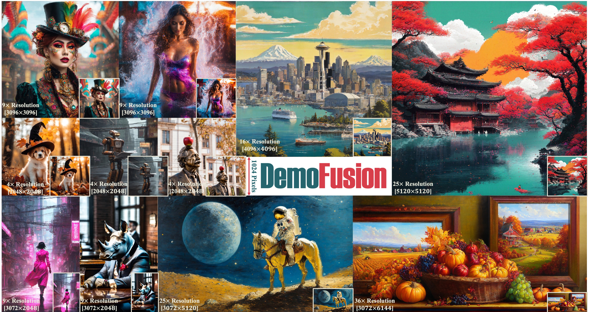

# DemoFusion
[](https://badges.toozhao.com/stats/01HFMAPCVTA1T32KN2PASNYGYK "Get your own page views count badge on badges.toozhao.com")
[](https://pytorch.org/)
[](https://huggingface.co/docs/diffusers/index)
[](https://ruoyidu.github.io/demofusion/demofusion.html)
[](https://arxiv.org/abs/2101.12345)

Code release for "DemoFusion: Democratising High-resolution Image Generation without a Sweat" (arXiv）



**Abstract**: While the diffusion model has seen rapid advancements, its progression towards high-resolution generation is tempered by the significant resource demands accompanying increased resolutions. In this paper, we argue that existing well-trained latent diffusion models already harbor sufficient prior knowledge to generate higher-resolution images; they just need the proper guidance to unlock this potential. To democratise high-resolution generation, we introduce a novel denoising framework that can be applied to most latent diffusion models to produce higher-resolution images dubbed DemoFusion. DemoFusion does not require any model tuning or additional memory. The only trade-off? More patience, which is a prerequisite even when employing high-resolution models to begin with. Specifically, DemoFusion is built upon the fusion of multiple diffusion paths and works in a progressive upscaling manner. We also devise two global guidance techniques, skip residual and dilated sampling, to steer various diffusion paths, ensuring the local content generated harmonizes with the overarching image structure, thereby eliminating any production of inconsistent or redundant content. Honoring the intrinsic nature of the diffusion model, which prioritizes restoring the macro structure before the minutiae during denoising, we gradually diminish the global guidance throughout the process, allowing the entire framework to work smoothly. Experimental results show that DemoFusion can not only generate high-resolution images but also deliver local details that are unattainable at lower-resolution generation.

# News

# Todos
The code will come soon.

# Usage

## Citation
If you find this paper useful in your research, please consider citing:
```
@article{du2023demofusion,
    title={DemoFusion: Democratising High-resolution Image Generation without a Sweat},
    author={Ruoyi Du and Dongliang Chang and Timothy M. Hospedales and Yi-Zhe Song and Zhanyu Ma},
    journal={arXiv},
    year={2023}
}
```
- duruoyi@bupt.edu.cn
- mazhanyu@bupt.edu.cn
