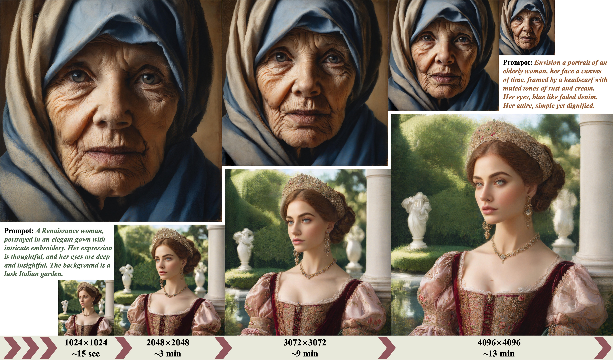

# DemoFusion
[](https://ruoyidu.github.io/demofusion/demofusion.html)
[](https://arxiv.org/pdf/2311.16973.pdf)
[](https://pytorch.org/)
[](https://huggingface.co/docs/diffusers/index)
[](https://badges.toozhao.com/stats/01HFMAPCVTA1T32KN2PASNYGYK "Get your own page views count badge on badges.toozhao.com")

Code release for "DemoFusion: Democratising High-Resolution Image Generation With No 💰" (arXiv 2023)


**Abstract**: High-resolution image generation with Generative Artificial Intelligence (GenAI) has immense potential but, due to the enormous capital investment required for training, it is increasingly centralised to a few large corporations, and hidden behind paywalls. This paper aims to democratise high-resolution GenAI by advancing the frontier of high-resolution generation while remaining accessible to a broad audience. We demonstrate that existing Latent Diffusion Models (LDMs) possess untapped potential for higher-resolution image generation. Our novel DemoFusion framework seamlessly extends open-source GenAI models, employing Progressive Upscaling, Skip Residual, and Dilated Sampling mechanisms to achieve higher-resolution image generation. The progressive nature of DemoFusion requires more passes, but the intermediate results can serve as "previews", facilitating rapid prompt iteration.



# News
- **2023.11.29**: 'pipeline_demofusion_sdxl' is released.

# Usage
- The version requirements of core dependencies.
```
torch==2.1.0
diffusers==0.21.4
```
- Download `pipeline_demofusion_sdxl.py` and run it as follows. A use case can be found in `demo.ipynb`.
```
from pipeline_demofusion_sdxl import DemoFusionSDXLPipeline

model_ckpt = "stabilityai/stable-diffusion-xl-base-1.0"
pipe = DemoFusionSDXLPipeline.from_pretrained(model_ckpt, torch_dtype=torch.float16)
pipe = pipe.to("cuda")

prompt = "Envision a portrait of an elderly woman, her face a canvas of time, framed by a headscarf with muted tones of rust and cream. Her eyes, blue like faded denim. Her attire, simple yet dignified."
negative_prompt = "blurry, ugly, duplicate, poorly drawn, deformed, mosaic"

images = pipe(prompt, negative_prompt=negative_prompt,
              height=3072, width=3072, view_batch_size=16, stride=64,
              num_inference_steps=50, guidance_scale=7.5,
              cosine_scale_1=3, cosine_scale_2=1, cosine_scale_3=1, sigma=0.8,
              multi_decoder=True, show_image=True
             )
```
- Please feel free to try different prompts and resolutions.
- Default hyper-parameters are recommended, but they may not be optimal for all cases. For specific impacts of each hyper-parameter, please refer to Appendix C in the DemoFusion paper.
- The code was cleaned before the release. If you encounter any issues, please contact us.

## Citation
If you find this paper useful in your research, please consider citing:
```
@article{du2023demofusion,
    title={DemoFusion: Democratising High-Resolution Image Generation With No $$$},
    author={Ruoyi Du and Dongliang Chang and Timothy M. Hospedales and Yi-Zhe Song and Zhanyu Ma},
    journal={arXiv},
    year={2023}
}
```
