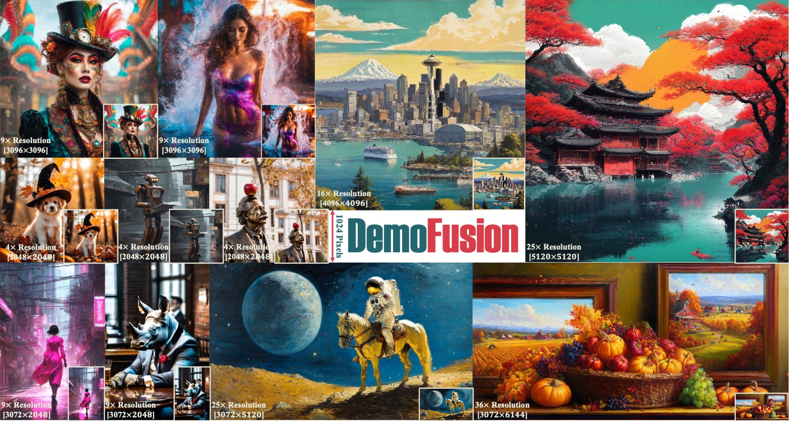
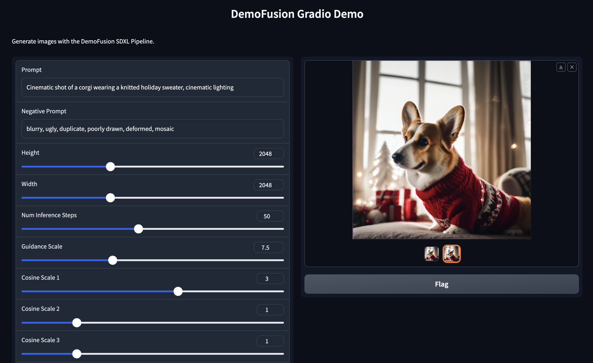

# DemoFusion
[](https://ruoyidu.github.io/demofusion/demofusion.html)
[](https://arxiv.org/pdf/2311.16973.pdf)
[](https://replicate.com/lucataco/demofusion)
[](https://colab.research.google.com/github/camenduru/DemoFusion-colab/blob/main/DemoFusion_colab.ipynb)
[](https://huggingface.co/spaces/radames/Enhance-This-DemoFusion-SDXL)
[](https://badges.toozhao.com/stats/01HFMAPCVTA1T32KN2PASNYGYK "Get your own page views count badge on badges.toozhao.com")

Code release for "DemoFusion: Democratising High-Resolution Image Generation With No 💰" (arXiv 2023)



**Abstract**: High-resolution image generation with Generative Artificial Intelligence (GenAI) has immense potential but, due to the enormous capital investment required for training, it is increasingly centralised to a few large corporations, and hidden behind paywalls. This paper aims to democratise high-resolution GenAI by advancing the frontier of high-resolution generation while remaining accessible to a broad audience. We demonstrate that existing Latent Diffusion Models (LDMs) possess untapped potential for higher-resolution image generation. Our novel DemoFusion framework seamlessly extends open-source GenAI models, employing Progressive Upscaling, Skip Residual, and Dilated Sampling mechanisms to achieve higher-resolution image generation. The progressive nature of DemoFusion requires more passes, but the intermediate results can serve as "previews", facilitating rapid prompt iteration.

# News
- **2023.12.12**: ✨ DemoFusion with ControNet is availabe now! Check it out at `pipeline_demofusion_sdxl_controlnet`! The local [Gradio Demo](https://github.com/PRIS-CV/DemoFusion#DemoFusion+ControlNet-with-local-Gradio-demo) is also available.
- **2023.12.10**: ✨ Image2Image is supported by `pipeline_demofusion_sdxl` now! The local [Gradio Demo](https://github.com/PRIS-CV/DemoFusion#Image2Image-with-local-Gradio-demo) is also available.
- **2023.12.08**: 🚀 A HuggingFace Demo for Img2Img is now available! [](https://huggingface.co/spaces/radames/Enhance-This-DemoFusion-SDXL) Thank [Radamés](https://github.com/radames) for the implementation and [](https://huggingface.co/docs/diffusers/index) for the support!
- **2023.12.07**: 🚀 Add Colab demo [](https://colab.research.google.com/github/camenduru/DemoFusion-colab/blob/main/DemoFusion_colab.ipynb). Check it out! Thank [camenduru](https://github.com/camenduru) for the implementation!
- **2023.12.06**: ✨ The local [Gradio Demo](https://github.com/PRIS-CV/DemoFusion#Text2Image-with-local-Gradio-demo) is now available! Better interaction and presentation!
- **2023.12.04**: ✨ A [low-vram version](https://github.com/PRIS-CV/DemoFusion#Text2Image-on-Windows-with-8-GB-of-VRAM) of DemoFusion is available! Thank [klimaleksus](https://github.com/klimaleksus) for the implementation!
- **2023.12.01**: 🚀 Integrated to [Replicate](https://replicate.com/explore). Check out the online demo: [](https://replicate.com/lucataco/demofusion) Thank [Luis C.](https://github.com/lucataco) for the implementation!
- **2023.11.29**: 💰 `pipeline_demofusion_sdxl` is released.

# Usage
## A quick try with integrated demos
- HuggingFace Space: Try Text2Image generation at [](https://huggingface.co/spaces/fffiloni/DemoFusion) and Image2Image enhancement at [](https://huggingface.co/spaces/radames/Enhance-This-DemoFusion-SDXL).
- Colab: Try Text2Image generation at [](https://colab.research.google.com/github/camenduru/DemoFusion-colab/blob/main/DemoFusion_colab.ipynb) and Image2Image enhancement at [](https://colab.research.google.com/github/camenduru/DemoFusion-colab/blob/main/DemoFusion_img2img_colab.ipynb).
- Replicate: Try Text2Image generation at [](https://replicate.com/lucataco/demofusion) and Image2Image enhancement at [](https://replicate.com/lucataco/demofusion-enhance).

## Starting with our code
### Text2Image (will take about 17 GB of VRAM)
- Set up the dependencies as:
```
conda create -n demofusion python=3.9
conda activate demofusion
pip install -r requirements.txt
```
- Download `pipeline_demofusion_sdxl.py` and run it as follows. A use case can be found in `demo.ipynb`.
```
from pipeline_demofusion_sdxl import DemoFusionSDXLPipeline

model_ckpt = "stabilityai/stable-diffusion-xl-base-1.0"
pipe = DemoFusionSDXLPipeline.from_pretrained(model_ckpt, torch_dtype=torch.float16)
pipe = pipe.to("cuda")

prompt = "Envision a portrait of an elderly woman, her face a canvas of time, framed by a headscarf with muted tones of rust and cream. Her eyes, blue like faded denim. Her attire, simple yet dignified."
negative_prompt = "blurry, ugly, duplicate, poorly drawn, deformed, mosaic"

images = pipe(prompt, negative_prompt=negative_prompt,
              height=3072, width=3072, view_batch_size=16, stride=64,
              num_inference_steps=50, guidance_scale=7.5,
              cosine_scale_1=3, cosine_scale_2=1, cosine_scale_3=1, sigma=0.8,
              multi_decoder=True, show_image=True
             )

for i, image in enumerate(images):
    image.save('image_' + str(i) + '.png')
```
- ⚠️ When you have enough VRAM (e.g., generating 2048*2048 images on hardware with more than 18GB RAM), you can set `multi_decoder=False`, which can make the decoding process faster.
- Please feel free to try different prompts and resolutions.
- Default hyper-parameters are recommended, but they may not be optimal for all cases. For specific impacts of each hyper-parameter, please refer to Appendix C in the DemoFusion paper.
- The code was cleaned before the release. If you encounter any issues, please contact us.

### Text2Image on Windows with 8 GB of VRAM

- Set up the environment as:

```
cmd
git clone "https://github.com/PRIS-CV/DemoFusion"
cd DemoFusion
python -m venv venv
venv\Scripts\activate
pip install -U "xformers==0.0.22.post7+cu118" --index-url https://download.pytorch.org/whl/cu118
pip install "diffusers==0.21.4" "matplotlib==3.8.2" "transformers==4.35.2" "accelerate==0.25.0"
```

- Launch DemoFusion as follows. The use case can be found in `demo_lowvram.py`.

```
python
from pipeline_demofusion_sdxl import DemoFusionSDXLPipeline

import torch
from diffusers.models import AutoencoderKL
vae = AutoencoderKL.from_pretrained("madebyollin/sdxl-vae-fp16-fix", torch_dtype=torch.float16)

model_ckpt = "stabilityai/stable-diffusion-xl-base-1.0"
pipe = DemoFusionSDXLPipeline.from_pretrained(model_ckpt, torch_dtype=torch.float16, vae=vae)
pipe = pipe.to("cuda")

prompt = "Envision a portrait of an elderly woman, her face a canvas of time, framed by a headscarf with muted tones of rust and cream. Her eyes, blue like faded denim. Her attire, simple yet dignified."
negative_prompt = "blurry, ugly, duplicate, poorly drawn, deformed, mosaic"

images = pipe(prompt, negative_prompt=negative_prompt,
              height=2048, width=2048, view_batch_size=4, stride=64,
              num_inference_steps=40, guidance_scale=7.5,
              cosine_scale_1=3, cosine_scale_2=1, cosine_scale_3=1, sigma=0.8,
              multi_decoder=True, show_image=False, lowvram=True
             )

for i, image in enumerate(images):
    image.save('image_' + str(i) + '.png')
```
### Text2Image with local Gradio demo
- Make sure you have installed `gradio` and `gradio_imageslider`.
- Launch DemoFusion via Gradio demo now -- try `python gradio_demo.py`! Better Interaction and Presentation！


### Image2Image with local Gradio demo
- Make sure you have installed `gradio` and `gradio_imageslider`.
- Launch DemoFusion Image2Image by `python gradio_demo_img2img.py`.

- ⚠️ Please note that, as a tuning-free framework, DemoFusion's Image2Image capability is strongly correlated with the SDXL's training data distribution and will show a significant bias. An accurate prompt to describe the content and style of the input also significantly improves performance. Have fun and regard it as a side application of text+image based generation.

### DemoFusion+ControlNet with local Gradio demo
- Make sure you have installed `gradio` and `gradio_imageslider`.
- Launch DemoFusion+ControNet Text2Image by `python gradio_demo.py`.
- 
- Launch DemoFusion+ControNet Image2Image by `python gradio_demo_img2img.py`.
- 

## Citation
If you find this paper useful in your research, please consider citing:
```
@article{du2023demofusion,
  title={DemoFusion: Democratising High-Resolution Image Generation With No $$$},
  author={Du, Ruoyi and Chang, Dongliang and Hospedales, Timothy and Song, Yi-Zhe and Ma, Zhanyu},
  journal={arXiv preprint arXiv:2311.16973},
  year={2023}
}
```
